# Arşivleme ve Yedekleme Politikaları

Kurumsal kod tabanının güvenliği ve sürdürülebilirliği için aşağıdaki arşivleme ve yedekleme politikaları uygulanır:

## 1. Kaynak Kod Yedekleme
- Tüm kod değişiklikleri, merkezi bir Git sunucusunda (örn. GitHub, GitLab, Bitbucket) ana dalda tutulur.
- Her gün sonunda ana dal (main) otomatik olarak yedeklenir.
- Kritik sürümler için manuel olarak etiket (tag) ve release oluşturulur.

## 2. Dokümantasyon ve Konfigürasyon Yedekleme
- Tüm dokümantasyon ve yapılandırma dosyaları da kod ile birlikte versiyonlanır.
- Harici dokümanlar (örn. Word, PDF) bulut tabanlı kurumsal depolama alanlarında (örn. SharePoint, Google Drive) yedeklenir.

## 3. Arşivleme
- Kullanımdan kalkan veya eski sürümler, ayrı bir "archive" klasöründe veya ayrı bir Git branch/tag altında saklanır.
- Arşivlenen kod ve dokümanlar salt okunur (read-only) olarak tutulur.

## 4. Otomasyon ve Sorumluluk
- Yedekleme işlemleri mümkünse otomatikleştirilir (örn. CI/CD pipeline ile).
- Yedekleme ve arşivleme sorumluluğu proje yöneticisi veya belirlenen DevOps mühendisine aittir.

## 5. Erişim ve Güvenlik
- Yedeklenen ve arşivlenen verilere sadece yetkili ekip üyeleri erişebilir.
- Yedekler şifreli ve güvenli ortamlarda saklanır.

Bu politikalar, veri kaybı riskini en aza indirmek ve kurumsal sürdürülebilirliği sağlamak için zorunludur.
# Klasör ve Dosya İsimlendirme Standartları

Kurumsal projede tutarlılık ve okunabilirlik için aşağıdaki klasör ve dosya isimlendirme standartları uygulanır:

## Klasör İsimlendirme
- Tüm klasör adları küçük harf ve tire (`-`) veya camelCase ile yazılır (örn. `shared`, `core`, `user-profile`).
- Feature modülleri ve ana işlevsel klasörler çoğul değil tekil isimle adlandırılır (örn. `user`, `dashboard`).
- Ortak klasörler: `shared`, `core`, `features`, `pages`.
- Alt klasörler işlevine göre açıkça adlandırılır: `components`, `services`, `pipes`, `directives`, `guards`, `interceptors`, `utils`.

## Dosya İsimlendirme
- Tüm dosya adları küçük harf ve tire (`-`) ile yazılır (örn. `user-profile.component.ts`).
- Angular bileşenleri: `feature-adı.component.ts` (örn. `login.component.ts`)
- Servisler: `feature-adı.service.ts` (örn. `auth.service.ts`)
- Guard'lar: `feature-adı.guard.ts` (örn. `auth.guard.ts`)
- Pipe'lar: `feature-adı.pipe.ts` (örn. `capitalize.pipe.ts`)
- Directive'ler: `feature-adı.directive.ts` (örn. `autofocus.directive.ts`)
- Modül dosyaları: `feature-adı.module.ts` (örn. `user.module.ts`)
- Test dosyaları: `.spec.ts` uzantısı ile (örn. `login.component.spec.ts`)
- Ortak yardımcı dosyalar: `utils`, `helpers` gibi açıklayıcı isimlerle.

## Genel Standartlar
- Türkçe karakter kullanılmaz.
- Boşluk yerine tire veya camelCase kullanılır.
- Dosya ve klasör isimleri kısa, açıklayıcı ve işlevi yansıtacak şekilde seçilir.

Bu standartlar, kodun sürdürülebilirliğini ve ekip içi işbirliğini artırmak için zorunludur.

# Feature Flag (Özellik Bayrağı) Yönetimi

Kurumsal projede yeni veya riskli özelliklerin kontrollü şekilde açılıp kapatılması için merkezi feature flag altyapısı kullanılır.

- Tüm yeni özellikler, UI bileşenleri, sayfalar veya API çağrıları bir feature flag ile koşullandırılır.
- Feature flag'ler backend'de merkezi olarak yönetilir ve Angular uygulamasında `FeatureFlagService` ile dinamik olarak alınır.
- Route, component ve servislerde flag kontrolü yapılır. Örnek:
	```typescript
	this.featureFlagService.getByName('featureX').subscribe(flag => {
		if (flag?.enabled) {
			// Özellik aktif, göster
		}
	});
	```
- Route erişimi için `FeatureFlagGuard` kullanılır.
- Flag'ler, kodun başına açıklama olarak eklenir: `// Bu özellik feature flag ile kontrol edilmektedir.`

Detaylı kullanım ve entegrasyon için `src/core/services/feature-flag.service.ts` ve ilgili guard/interceptor dosyalarına bakınız.

Kurumsal kod tabanında ortak ve paylaşılan kodun sürdürülebilir şekilde yönetilmesi için aşağıdaki klasör yapısı uygulanmıştır:

| Klasör                        | Açıklama |
|-------------------------------|----------|
| shared/components             | Uygulama genelinde birden fazla yerde kullanılabilecek ortak Angular bileşenleri |
| shared/pipes                  | Ortak pipe'lar |
| shared/directives             | Ortak directive'ler |
| shared/services               | Birden fazla yerde kullanılabilecek yardımcı servisler |
| shared/utils                  | Ortak yardımcı fonksiyonlar ve util dosyaları |
| core/services                 | Uygulama genelinde bir kez kullanılan singleton servisler (ör. authentication, global error handler) |
| core/guards                   | Uygulama genelinde kullanılan route guard'lar |
| core/interceptors             | Uygulama genelinde kullanılan HTTP interceptor'lar |

Her klasörde açıklayıcı bir README dosyası bulunur. Bu yapı, kodun tekrar kullanılabilirliğini ve ekip içi işbirliğini artırır.
# Modül Sınırları ve Klasör Yapısı Açıklaması

Proje kod tabanında modülerlik ve sürdürülebilirlik amacıyla aşağıdaki ana klasörler oluşturulmuştur:

| Klasör     | Açıklama |
|------------|----------|
| core       | Uygulama genelinde kullanılan servisler, guard'lar, interceptor'lar ve altyapı kodları burada tutulur. Tekilleştirilmiş, uygulama bağımlı ve tekrar kullanılabilir olmayan kodlar için kullanılır. |
| shared     | Ortak bileşenler, pipe'lar, directive'ler ve uygulama genelinde birden fazla yerde kullanılabilecek yardımcı modüller burada yer alır. |
| features   | Her bir işlevsel modül (ör. kullanıcı yönetimi, dashboard, raporlama vb.) için ayrı alt klasörler burada oluşturulur. Her feature kendi bileşen, servis ve modüllerini içerir. |
| pages      | Sayfa bazlı bileşenler ve route'a karşılık gelen ana container bileşenler burada yer alır. Genellikle feature modüllerinin ana giriş noktalarıdır. |

Bu yapı, kodun okunabilirliğini, sürdürülebilirliğini ve ekip içi işbirliğini artırmak için kurumsal Angular projelerinde önerilen standarttır.
# Modül Bağımlılıkları Raporu

## 1. Ana Bağımlılıklar (dependencies)

| Paket Adı                | Sürüm     | Açıklama                                                      |
|--------------------------|-----------|---------------------------------------------------------------|
| @angular/common          | ^20.1.0   | Angular temel modülleri                                       |
| @angular/compiler        | ^20.1.0   | Angular derleyici                                             |
| @angular/core            | ^20.1.0   | Angular çekirdek modülü                                       |
| @angular/forms           | ^20.1.0   | Form yönetimi                                                 |
| @angular/platform-browser| ^20.1.0   | Tarayıcı platformu desteği                                    |
| @angular/router          | ^20.1.0   | Yönlendirme (routing)                                         |
| rxjs                     | ~7.8.0    | Reaktif programlama kütüphanesi                               |
| tslib                    | ^2.3.0    | TypeScript yardımcı fonksiyonları                             |
| zone.js                  | ~0.15.0   | Angular değişiklik algılama                                   |

## 2. Geliştirme Bağımlılıkları (devDependencies)

| Paket Adı                | Sürüm     | Açıklama                                                      |
|--------------------------|-----------|---------------------------------------------------------------|
| @angular/build           | ^20.1.5   | Angular build aracı                                           |
| @angular/cli             | ^20.1.5   | Angular CLI                                                   |
| @angular/compiler-cli    | ^20.1.0   | Angular derleyici CLI                                         |
| @types/jasmine           | ~5.1.0    | Jasmine için tip tanımları                                     |
| jasmine-core             | ~5.8.0    | Test framework (Jasmine)                                      |
| karma                    | ~6.4.0    | Test runner (Karma)                                           |
| karma-chrome-launcher    | ~3.2.0    | Chrome ile test çalıştırıcı                                   |
| karma-coverage           | ~2.2.0    | Test kapsam raporlayıcı                                       |
| karma-jasmine            | ~5.1.0    | Karma için Jasmine entegrasyonu                               |
| karma-jasmine-html-reporter | ~2.1.0 | HTML test raporlayıcı                                         |
| typescript               | ~5.8.2    | TypeScript derleyicisi                                        |

## 3. Bağımlılık İlişkileri ve Notlar

- Angular modülleri birbiriyle sıkı bağlıdır ve aynı ana sürümde tutulmalıdır.
- rxjs ve zone.js, Angular'ın reaktif ve değişiklik algılama altyapısı için zorunludur.
- Test altyapısı Jasmine ve Karma üzerine kuruludur.
- tslib ve typescript modern TypeScript projelerinde standarttır.

## 4. Güvenlik ve Sürüm Notları

- Tüm ana bağımlılıklar güncel ve Angular 20.x sürüm ailesine uygundur.
- Sürüm aralıkları (örn. ^20.1.0) ile küçük güncellemeler otomatik alınabilir.
- private: true ile paket dışa aktarılmaz, sadece kurum içi kullanım için uygundur.

## 5. Öneriler

- Bağımlılıkların güncelliği düzenli olarak kontrol edilmelidir.
- Kullanılmayan bağımlılıklar kaldırılmalıdır.
- Geliştirme ortamında güvenlik açıkları için periyodik denetim yapılmalıdır (örn. npm audit).
# Proje Klasör Hiyerarşisi (Mimari Diyagram)

```mermaid
flowchart TD
	A[Okirem_SPA]
	A --> B[angular.json]
	A --> C[Okirem_SPA.bat]
	A --> D[package.json]
	A --> E[README.md]
	A --> F[tsconfig.app.json]
	A --> G[tsconfig.json]
	A --> H[tsconfig.spec.json]
	A --> I[docs]
	A --> J[public]
	A --> K[scripts]
	A --> L[src]

	I --> I1[API_DOC.md]
	I --> I2[PROJECT_LOG.md]
	I --> I3[PROJECT_SNAPSHOT.md]
	I --> I4[PRPJECT_FAZ.MD]
	I --> I5[README.md]
	I --> I6[ROADMAP.md]
	I --> I7[ai]
	I --> I8[decisions]

	I7 --> I7a[AI_CONTEXT.md]
	I7 --> I7b[BRIEF.md]
	I7 --> I7c[GUNLUK_RUTIN.md]
	I7 --> I7d[README-INSTALL.md]
	I7 --> I7e[prompts]
	I7e --> I7e1[BOOTSTRAP_PROMPT.md]
	I7e --> I7e2[CODE_REVIEW_PROMPT.md]
	I7e --> I7e3[DAILY_STANDUP_PROMPT.md]
	I7e --> I7e4[FEATURE_SPEC_PROMPT.md]
	I7e --> I7e5[REFACTOR_PROMPT.md]

	I8 --> I8a[ADR_TEMPLATE.md]
	I8 --> I8b[ADR-0001.md]

	J --> J1[favicon.ico]

	K --> K1[ai]
	K1 --> K1a[create-issues.mjs]
	K1 --> K1b[create-pr.mjs]
	K1 --> K1c[docgen.mjs]
	K1 --> K1d[github-issue-utils.mjs]
	K1 --> K1e[log-day-plan.mjs]
	K1 --> K1f[utils.mjs]

	L --> L1[index.html]
	L --> L2[main.ts]
	L --> L3[styles.scss]
	L --> L4[app]
	L4 --> L4a[app.config.ts]
	L4 --> L4b[app.html]
	L4 --> L4c[app.routes.ts]
	L4 --> L4d[app.scss]
	L4 --> L4e[app.spec.ts]
	L4 --> L4f[app.ts]
```


# PROJECT_SNAPSHOT — Auto

## 0. Yönetici Özeti
- Angular: ^20.1.0
- Önemli bağımlılıklar:
- rxjs: ~7.8.0
- zone.js: ~0.15.0

## 1. Dosya Envanteri (özet)
- Routes: 1
- Guards: 0
- Interceptors: 0
- Services: 0
- Components: 0

## 2. Önemli Dosya Yolları
- src\app\app.routes.ts

## 3. Ortam Dosyaları
- Bulunamadı
